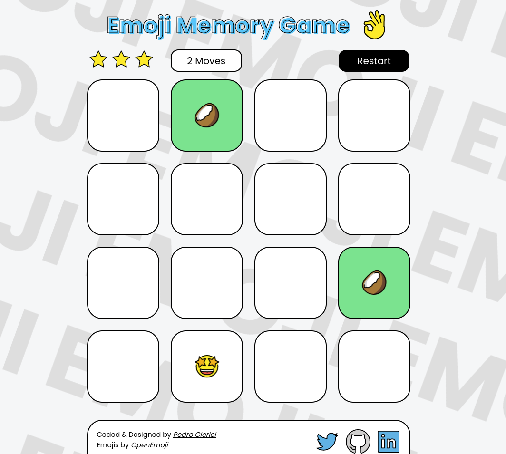

# Emoji Memory Game


## Table of Contents
* [Project Purpose](#project-purpose)
* [Features](#features)
* [Getting Started](#getting-started)
* [Credits](#credits)

## Project Purpose
The purpose of this project is to demonstrate my knowledge of html, CSS and Javascript.

## Features
* Different ending messages accordingly to the player's score.
* Mobile and desktop responsive.
* Moves counter.
* Restart button.

## Getting Started
You can play it [here](https://pedroclerici.github.io/emoji-memory-game/).
or you can clone it to your machine and open `index.html`

```bash
git clone https://github.com/PedroClerici/emoji_memory_game.git
```
## Credits
Thanks to [OpenMoji](https://openmoji.org/) for the emojis.